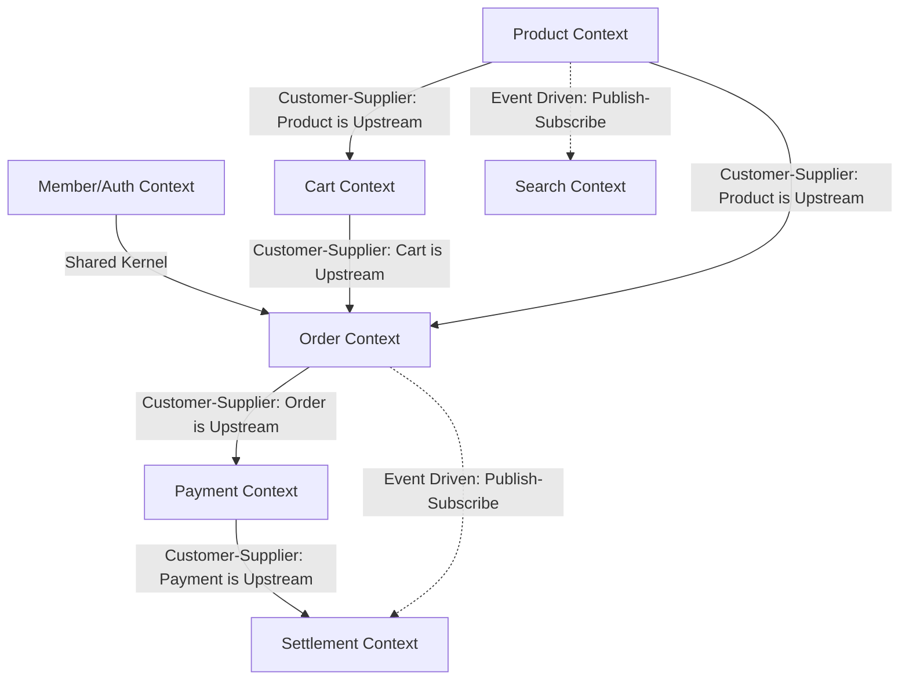

# 🌐 서브도메인 분리 및 Bounded Context 설계 (컨텍스트 맵)

커머스 시스템의 서브도메인 경계를 정의하고 각 Bounded Context 간의 의존성 관계를 나타내는 컨텍스트 맵을 정의합니다.

---

## 1. 서브도메인(Subdomain) 분류
도메인을 비즈니스 중요도 및 성격에 따라 3가지 유형으로 분류합니다.

### 1) 핵심 도메인 (Core Domain)
비즈니스의 경쟁 우위를 창출하며 가장 역량을 투입해야 하는 영역입니다.
*   **주문 (Order)**: 장바구니 상품 결합, 주문 수량 및 상태 전환, 트랜잭션 경계 제어.
*   **결제 (Payment)**: 외부 PG 연동의 복잡성 해결 및 멱등성 보장, 상태 전환 흐름 관리.
*   **정산 (Settlement)**: 판매대금 수수료 계산, 대용량 정산 파이프라인.

### 2) 지원 도메인 (Supporting Subdomain)
비즈니스에 필수적이지만 경쟁 우위의 핵심은 아니며, 자체 구현이 권장되는 맞춤형 영역입니다.
*   **상품 (Product)**: 카테고리 관리, 상품 노출 상태 전환, 실시간 재고 차감 및 복구.
*   **장바구니 (Cart)**: 사용자별 임시 저장소, 가격 스냅샷 유지.
*   **검색 (Search)**: 대용량 상품 데이터 색인 및 자동완성 검색 기능 제공.

### 3) 일반 도메인 (Generic Subdomain)
비즈니스 특화 기능이 아니며, 외부 솔루션이나 표준 라이브러리로 대체 가능한 영역입니다.
*   **회원/인증 (Member/Auth)**: 사용자 정보 관리, JWT 인증 및 권한 확인.

---

## 2. Bounded Context 정의 및 경계

각 서브도메인은 물리적/논리적으로 격리된 영역인 **Bounded Context**를 가집니다.

*   `Member Context`: 회원가입, 로그인 및 인증 토큰 발급.
*   `Product Context`: 상품 등록, 조회 및 재고 트랜잭션 관리.
*   `Cart Context`: 고객 장바구니 관리 (임시 성격).
*   `Order Context`: 주문 접수, 취소 및 보상 트랜잭션 관리.
*   `Payment Context`: PG 결제 승인, 취소 및 감사 로그 관리.
*   `Settlement Context`: 정산 파이프라인 작동 및 정산 원장 관리.
*   `Search Context`: 엘라스틱서치 인덱싱 기반 상품 검색.

---

## 3. 컨텍스트 맵 (Context Map)

각 Context 간의 상호작용 방식과 의존 관계(Upstream/Downstream)를 설정합니다.

### Context Map 다이어그램 (Mermaid)

### 관계 설명 (Upstream / Downstream)

1.  **Member Context ↔ Order Context (Shared Kernel)**
    *   인증된 사용자 ID와 배송 정보 스키마 등을 서로 공유하여 사용합니다.
2.  **Product Context (Upstream) ➔ Order Context (Downstream)**
    *   주문 생성 시 상품 정보 검증 및 재고를 확인/차감해야 하므로 주문 도메인이 상품 도메인에 의존합니다. (D - U 관계)
3.  **Order Context (Upstream) ➔ Payment Context (Downstream)**
    *   주문 정보(주문 식별자, 결제 금액 등)를 기반으로 결제를 요청합니다. 결제 승인 여부에 따라 주문의 상태가 전이됩니다. (D - U 관계)
4.  **Payment Context (Upstream) ➔ Settlement Context (Downstream)**
    *   성공적으로 완료된 결제 정보들을 대량으로 수집하여 정산 배치가 수수료 계산 작업을 진행합니다.
5.  **Product Context (Upstream) - - ➔ Search Context (Downstream) [Event Driven]**
    *   상품 정보가 변경(등록/수정/삭제)될 때 비동기 이벤트를 발행하고, 검색 도메인이 이를 받아 검색 인덱스(Elasticsearch)를 갱신합니다.
