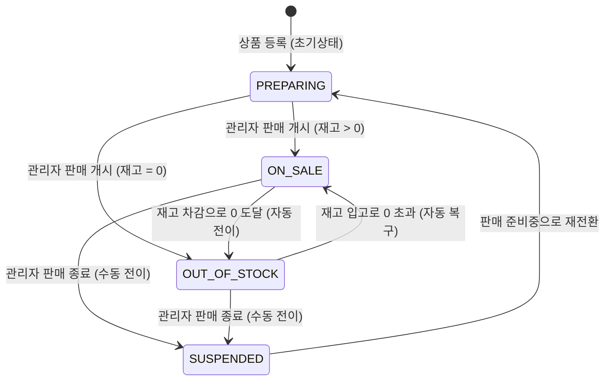
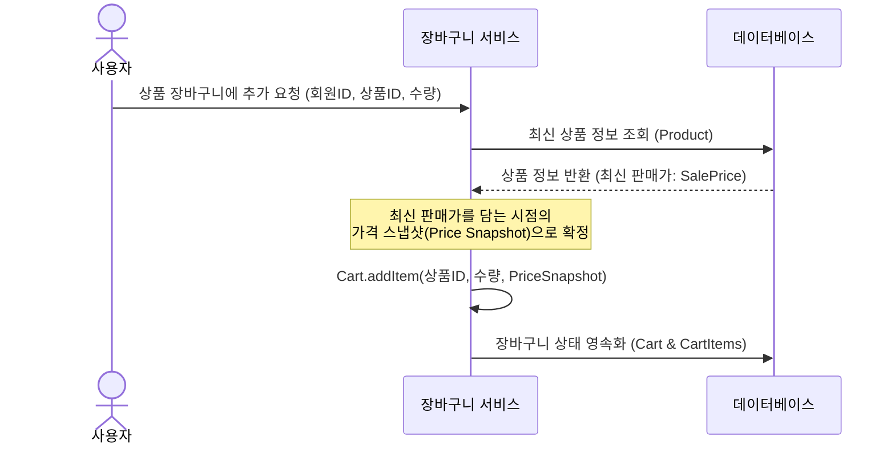

# 🌀 [2주차] 상품 상태 전이 및 장바구니 도메인 규칙 명세

이 문서는 2주차에 구현된 상품(Product) 애그리거트와 장바구니(Cart) 애그리거트 내의 비즈니스 제약 사항 및 상태 전이 규칙을 시각화하고 명세한 문서입니다.

---

## 1. 📦 상품(Product) 상태 전이 머신

상품은 판매 수명 주기에 따라 특정 상태로 흐르며, 재고 상태 및 관리자의 개입에 의해 전이가 결정됩니다.

### ① 상태 전이 다이어그램 (State Transition Diagram)

### ② 핵심 비즈니스 규칙 제약 사항
- **자동 품절 처리**: 상품이 `ON_SALE` 상태일 때 사용자의 주문 등으로 재고가 차감되어 `0`에 도달하면 시스템은 즉시 상태를 `OUT_OF_STOCK`으로 자동 변경합니다.
- **자동 판매 복구**: `OUT_OF_STOCK` 상태의 상품에 재고가 새로 추가(`increaseStock`)되어 `0`보다 커지면, 별도의 수동 조작 없이 자동으로 다시 `ON_SALE` 상태로 복구됩니다.
- **판매 종료 제약**: `SUSPENDED` 상태는 판매가 완전히 종료된 비활성화 상태입니다. 이 상태의 상품은 재고가 증가하거나 강제로 판매 개시할 수 없으며, 반드시 다시 `PREPARING` 상태를 거치도록 전이 흐름을 안전하게 차단합니다.

---

## 2. 🛒 장바구니(Cart) 도메인 정책 규칙

장바구니는 한 명의 회원(`memberId`)과 일대일 대응되는 라이프사이클을 갖는 Aggregate입니다.

### ① 가격 스냅샷(Price Snapshot) 정책 흐름
사용자가 상품을 장바구니에 담을 때, 현재 판매가가 저장되는 흐름입니다.

### ② 비즈니스 제약 규칙
1. **담기 제한**: 현재 상품의 상태가 `ON_SALE`(판매중)이 아닌 상품(예: `PREPARING`, `SUSPENDED`, `OUT_OF_STOCK`)은 장바구니에 신규 추가될 수 없습니다.
2. **동일 상품 추가 시 수량 누적**: 이미 장바구니에 존재하는 상품을 추가할 경우, 기존 장바구니 아이템의 수량에 새로운 수량을 더하고, 가격 스냅샷은 추가하는 시점의 최신 판매가로 업데이트합니다.
3. **수량 0 이하 시 자동 제거**: 수량 변경 API 등을 통해 장바구니 항목의 수량을 `0` 이하로 설정할 경우, 해당 아이템은 장바구니 내에서 영구적으로 삭제됩니다.
