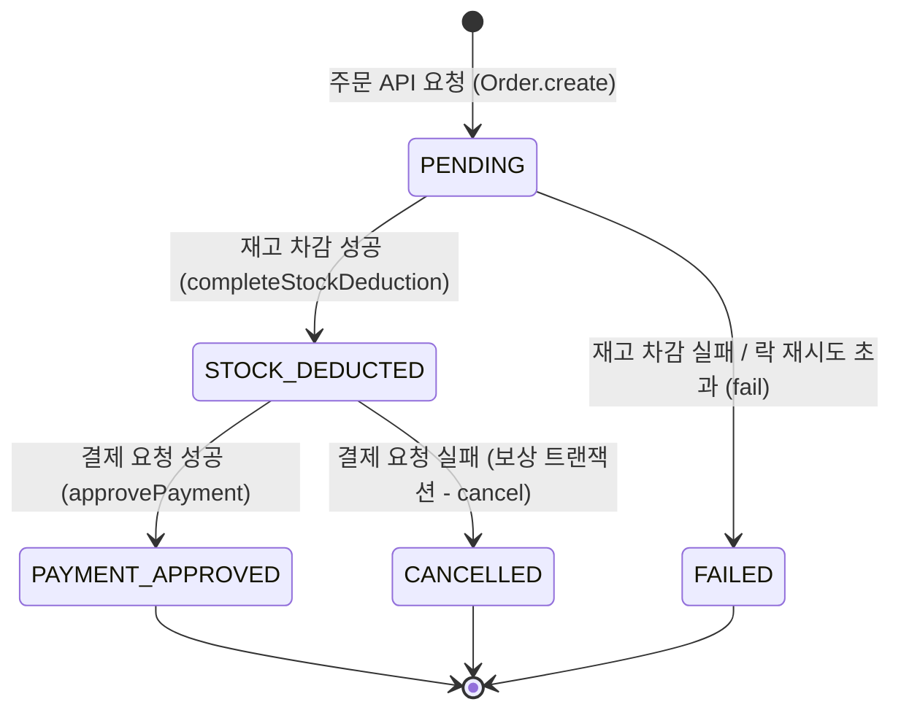
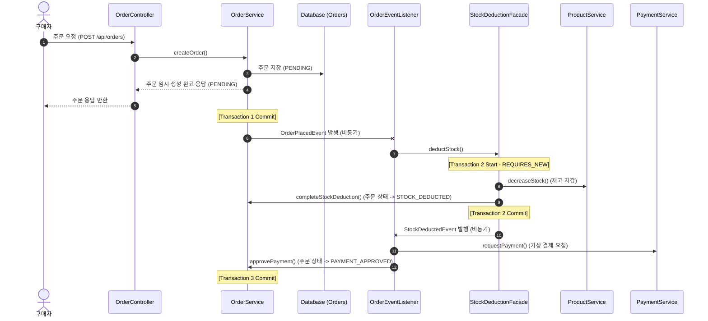
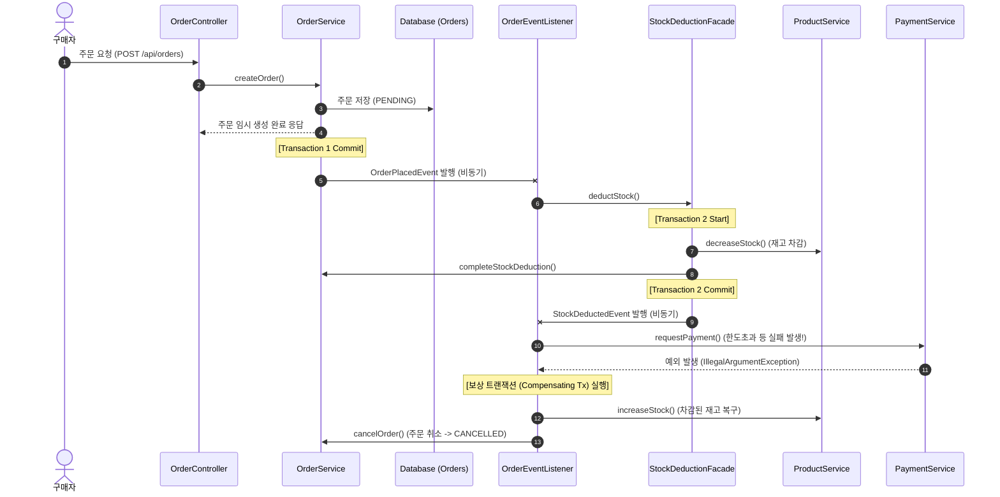

# 📊 주문 상태 전이 및 도메인 이벤트 흐름 설계서

## 1. 🔄 주문 상태 전이 다이어그램 (Order Status State Machine)
주문의 상태는 아래와 같이 전이되며, 한 번 최종 상태(`CANCELLED`, `FAILED`)에 도달한 주문은 상태 변경이 차단됩니다.

---

## 2. ⚡ 도메인 이벤트 흐름도 (Event & Compensating Transaction Flow)
각 트랜잭션이 독립된 비동기 스레드에서 Saga 형태로 실행되는 흐름과 예외 발생 시의 보상 트랜잭션 흐름입니다.

### 1) 정상 흐름 (Happy Path)

### 2) 결제 실패 시 보상 트랜잭션 흐름 (Compensation Path)

