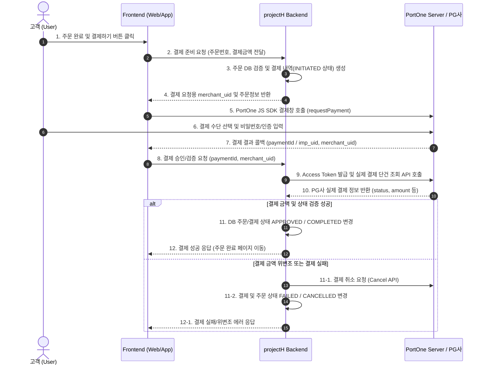

# 📚 [4주차] 필수 이론 학습 및 개념 정리 노트

## 1. 🧩 포트원(PortOne, 구 아임포트) 개요 및 API 연동 흐름

### 1) 포트원(PortOne)이란?
포트원은 다양한 PG사(토스페이먼츠, KG이니시스, NHN KCP, 카카오페이 등)의 결제 API를 하나의 표준화된 SDK 및 REST API 인터페이스로 제공해 주는 결제 통합 게이트웨이 서비스입니다.

---

### 2) 테스트 계정 및 연동 환경 구성 가이드
1. **포트원 관리자 콘솔 가입**: [PortOne Admin Console](https://admin.portone.io/) 접속 후 계정 생성
2. **테스트 채널 설정**:
   - `결제 연동` -> `연동 정보` 메뉴 이동
   - 테스트 PG사 설정 (예: `토스페이먼츠(테스트)` 또는 `카카오페이(테스트)`)
3. **주요 연동 키(Credentials) 수집**:
   - `Store ID` (고객사 식별코드)
   - `API Key` & `API Secret` (서버 간 REST API 통신 및 토큰 발급용)
4. **Spring Boot `application.yml` 설정 예시**:
   ```yaml
   portone:
     store-id: ${PORTONE_STORE_ID:store-test-xxxx}
     api-key: ${PORTONE_API_KEY:test_api_key}
     api-secret: ${PORTONE_API_SECRET:test_api_secret}
     base-url: https://api.portone.io # V2 API 기준 (V1은 https://api.iamport.kr)
   ```

---

### 3) 결제 연동 시퀀스 (Payment Flow)



---

### 4) 클라이언트 단독 승인의 위험성과 서버 측 위변조 검증(Server-Side Verification)

#### ⚠️ 왜 백엔드 검증이 필수인가?
- 프론트엔드(브라우저) 환경은 사용자가 F12 개발자 도구 등을 통해 JavaScript 코드나 네트워크 요청 패킷을 조작할 수 있습니다.
- 예를 들어, 100,000원짜리 상품을 결제할 때 클라이언트 결제 요청 금액을 100원으로 위변조하여 PG 승인을 받아버리는 보안 공격이 가능합니다.

#### 🛡️ 위변조 검증 프로세스
1. 백엔드는 **주문 생성 시점의 서버 계산 금액**을 DB에 저장해 둡니다.
2. 클라이언트가 결제를 마친 후 반환된 `paymentId`를 백엔드로 보냅니다.
3. 백엔드는 포트원 서버에 `paymentId`로 단건 조회를 수행하여 **포트원에 실제 결제된 금액**을 조회합니다.
4. `서버 DB 주문 금액 == 포트원 조회 실제 결제 금액` 및 `status == PAID/APPROVED` 여부를 철저히 검증합니다.
5. 금액이 다를 경우 즉시 포트원 결제 취소 API를 호출하고 에러 처리합니다.
