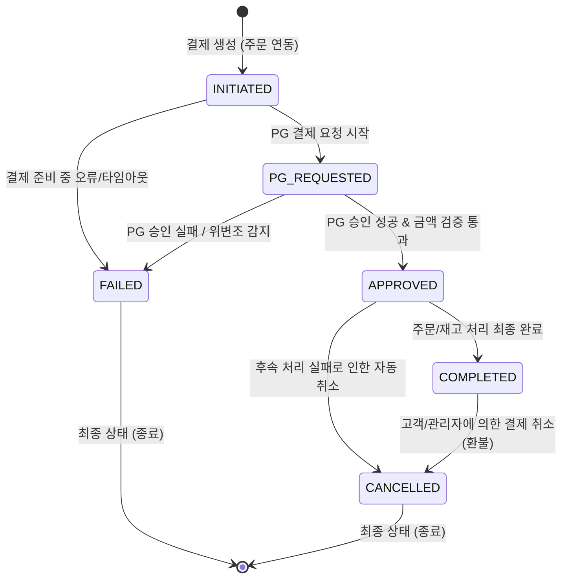

# 🔄 [4주차] 결제 상태 머신 설계서 (Payment State Machine)

## 1. 🎯 결제 상태 머신 개요
결제 도메인은 외부 PG 연동, 네트워크 타임아웃, 중복 승인 요청, 금액 위변조 등 변수가 많은 불확실한 도메인입니다.  
따라서 결제 객체의 상태를 엄격하게 관리하고 허용되지 않은 상태 전이(State Transition)를 차단하는 **상태 머신(State Machine)** 구조가 필수적입니다.

---

## 2. 📊 결제 상태 전이 다이어그램 (State Transition Diagram)

---

## 3. 📝 결제 상태 정의 및 전이 규칙 (State Matrix)

| 상태 (Status) | 설명 | 가능한 다음 상태 | 비고 |
| :--- | :--- | :--- | :--- |
| **`INITIATED`** | 결제 요청이 생성된 초기 상태 | `PG_REQUESTED`, `FAILED` | 결제 고유 멱등키 및 주문 정보 매핑 |
| **`PG_REQUESTED`** | PG사 승인 요청 진행 중 | `APPROVED`, `FAILED` | 동시 중복 승인 요청 차단 락(Lock) 구간 |
| **`APPROVED`** | PG 승인 완료 및 금액 검증 성공 | `COMPLETED`, `CANCELLED` | PG 승인은 완료되었으나 내부 시스템 후속 처리 대기 |
| **`COMPLETED`** | 결제 및 최종 주문 확정 완료 | `CANCELLED` | 정상 완료 상태 |
| **`FAILED`** | 승인 실패, 금액 위변조, 타임아웃 | (없음 - Terminated) | 실패 사유(Failure Code/Reason) 기록 |
| **`CANCELLED`** | 결제 취소 및 환불 처리 완료 | (없음 - Terminated) | 취소 사유 및 PG 취소 번호 기록 |

---

## 4. 🔒 상태 전이 검증 원칙 (Domain Invariants)
1. **단방향 불변성 (Immutability of Terminal States)**:
   - `FAILED` 및 `CANCELLED` 상태는 최종 상태(Terminal State)로, 어떤 상태로도 다시 전이될 수 없습니다.
2. **동일 상태 재진입 방지 (Idempotent State Check)**:
   - 이미 `COMPLETED`된 결제에 대해 동일한 완료 요청이 올 경우 에러가 아닌 기존 완료 객체를 반환합니다.
3. **잘못된 전이 차단 (Invalid Transition Protection)**:
   - 예: `INITIATED` 상태에서 곧바로 `COMPLETED`로 진입 시도 시 `IllegalStateException` 예외 발생.
